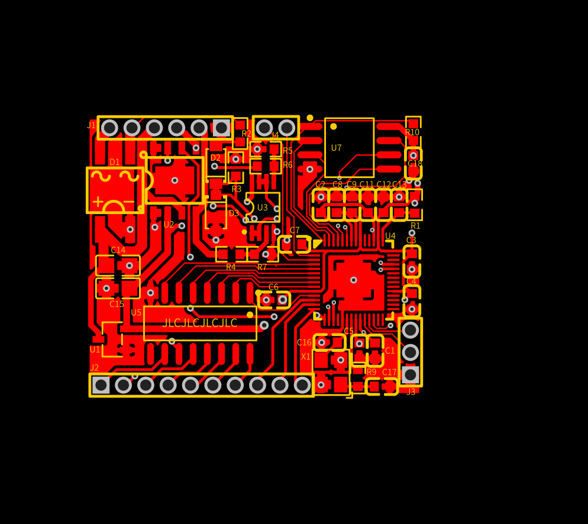

The RP2040-Decoder is a DIY DCC Decoder for locomotives which aims to be cost effective. It is based around a RP2040 microcontroller. 
The Software is written in C and licensed with the MIT license.
The Hardware and all the associated Design Files are licensed with the CERN Open Hardware Licence Version 2 - Permissive.

 

Further details about the project can be found here:  [RP2040-Decoder Wiki](https://github.com/GabrielKoppenstein/pico-decoder/wiki)
