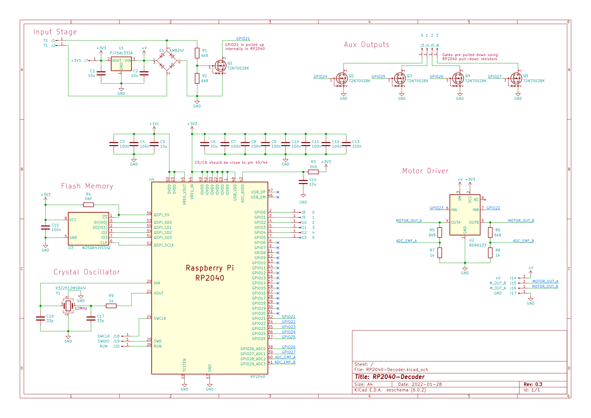

Overview
==============================

.. figure:: ../../../../svg/hw/Legacy/Block_Diagram_Hardware.svg
   :alt: Block Diagram
   :align: center

   Harware block diagram

The above block diagram gives a general overview regarding the operation of components. For better illustration it has been divided into four functional blocks. Furthermore, these functional blocks can be subdivided and will be explained below.

- **Input Stage**
   - DCC Signal Level Shift
   - Bridge Rectifier & Voltage Regulator
- **Motor Driver**
   - Motor Driver
   - Back EMF measurement (ADC)
- **General Purpose**
   - GPIO
   - Auxiliary output
- **Microcontroller**
   - Flash memory
   - Crystal oscillator

Electrical Characteristics
==============================
.. table:: Electrical Characteristics & Absolute Maximum Ratings
   :widths: auto

   =====================================================  =============================  =========  =========  =====
   Parameter                                              Symbol                         Minimum    Maximum    Unit
   =====================================================  =============================  =========  =========  =====
   Absolute max. DCC Input Voltage difference             V\ :sub:`DCC`\                 0          +24        V
   Absolute max. GPIO Voltage\ :sup:`(0)`\                V\ :sub:`PIN`\                 -0.5       3.3+0.5    V
   Input Voltage High\ :sup:`(0)`\                        V\ :sub:`IH`\                  2.145      3.6        V
   Input Voltage Low\ :sup:`(0)`\                         V\ :sub:`IL`\                  0          1.155      V
   Total GPIO Current\ :sup:`(0)`\                        I\ :sub:`IOVDD`\                          50         mA
   Absolute max. motor output current\ :sup:`(1)`\        I\ :sub:`MOTOR`\                          2.8        A
   Absolute max. auxiliary output current \ :sup:`(2)`\   I\ :sub:`AUX`\                            400        mA
   =====================================================  =============================  =========  =========  =====

(0): According to: `RP2040 Datasheet <https://datasheets.raspberrypi.com/rp2040/rp2040-datasheet.pdf>`_ (assuming V\ :sub:`DD`\ = 3.3V)

(1): According to: `BDR6133 Datasheet <https://www.lcsc.com/datasheet/lcsc_datasheet_2409291808_Bardeen-Micro--BDR6133_C2687793.pdf>`_

(2): According to: `T2N7002BK Datasheet <https://toshiba.semicon-storage.com/info/T2N7002BK_datasheet_en_20191025.pdf?did=30376&prodName=T2N7002BK>`_

.. note:: Keep in mind that realistically these maximum ratings can't be reached in practice due to thermal limitations. For example the motor current can probably not exceed 1.5A for continuous operation.

Input Stage
==============================

.. figure:: ../../../../svg/hw/Legacy/Input_Stage.svg
   :alt: Input Stage
   :align: center

   Input stage

D1 Rectifies the DCC square-wave into +V, the amplitude is not critical as long as it's within the 25V limit. The rectified voltage +V is then provided to the 3.3V voltage regulator (U1) and to the motor driver (U2).

The MOSFET on the right effectively translates the rather high DCC voltage to a suitable level for the microcontroller to process. When Q1 is turned off GPIO21 is pulled high by the RP2040 internal pull-up resistor, as soon as Q1 gets turned on (V\ :sub:`GS`\ > V\ :sub:`GS,th`\), GPIO21 gets pulled to GND potential. R1 and R2 ensure that V\ :sub:`GS`\ doesn't exceed ±20V.

Motor Driver
==============================

.. figure:: ../../../../svg/hw/Legacy/Motor_Driver.svg
   :alt: Motor Driver
   :align: center

   Motor driver

The Motor Driver is a special H-Bridge IC that is made for DC motors. To control the motor, it is necessary to measure the back-EMF voltage, which is directly related to the motor's speed. This is done by the ADC, which measures at Points ADC_EMF_A and ADC_EMF_B. The two resistors work together as a voltage divider.

Auxiliary Outputs
==============================

.. figure:: ../../../../svg/hw/Legacy/Aux_Outputs.svg
   :alt: Auxiliary Outputs
   :align: center

   Auxiliary Outputs

Switching of loads can be done using four N-Channel MOSFETs (Q2 to Q5). The amount of current is somewhat dependend on either static R\ :sub:`DS(on)`\ losses and/or switching losses using PWM. They are switching on the low-side, which means the load effectively gets connected to GND potential as the transistor starts to conduct. GPIO24 - GPIO27 are used.

GPIO
==============================

To switch lighter loads, six GPIO soldering pads are connected to GPIO0 to GPIO5 pins. Although not yet set up in the software, they could be used as inputs as well (e.g. reed switch). GPIO0 and GPIO1 can also be used to facilitate stdio logging via UART, which can easily be set up in CMakeLists.txt.

Microcontroller
==============================

.. figure:: ../../../../svg/hw/Legacy/Microcontroller.svg
   :alt: Microcontroller
   :align: center

   Microcontroller, flash memory, crystal oscillator, ...

The Microcontroller needs a crystal oscillator for its clock. External flash memory holds the configuration variables and the program itself. R3 & C14 are used to filter ADC_AVDD (ADC Reference Voltage).

Complete Schematic
==============================

   
   Complete Schematic

.. _wiring_Legacy:

Wiring the Decoder
==============================

.. figure:: ../../../../svg/hw/Legacy/Wiring_diagram.svg
   :align: center
   :width: 700
   :alt: Wiring Diagram

   Wiring Diagram

The illustration above provides an example of a wiring configuration.
It supports the connection of up to 4 transistor-switched outputs and 6 GPIOs for lighter loads or custom applications.
When switching inductive loads, always include a free-wheeling diode to protect the circuit.