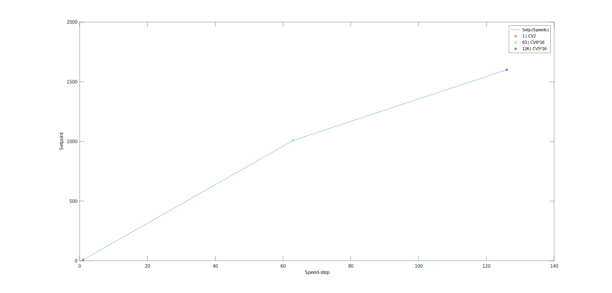
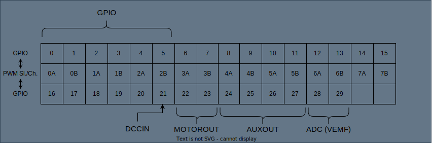

Configuration Variables (CV)
============================

.. note:: 
   
   - ``CV.h`` contains default values for every CV. When your board is still "factory new" these values are automatically written into flash. ``CV_65 == 255`` indicates a factory condition and resets all CVs to default.
   
   - Index 0 in the CV array corresponds with ``CV_1``, index 1 corresponds with ``CV_2`` and so forth.

Reset all CVs
------------------------

To reset all CVs to default, a value of ``8`` can be written to ``CV8``. Alternatively write a value of ``255`` to ``CV_65`` this will also reset all CVs to default, but only after power cycling the decoder.

Speed step configuration
------------------------

   Speed Table

* :math:`v_{min} = CV_{2}`
* :math:`v_{mid} = 16 \cdot CV_{6}`
* :math:`v_{max} = 16 \cdot CV_{5}`

The figure above shows how the speed steps can be configured using the corresponding CVs. The red * represents :math:`v_{min}` which is always at speed step 1, the green * shows :math:`v_{mid}` at speed step 63, and the blue * shows :math:`v_{max}` at speed step 126.

CV List
-------

:math:`CV_{1}` - Basic address
~~~~~~~~~~~~~~~~~~~~~~~~~~~~~~~~~~~~~~~~~~~~~~~~~~~~~~~~~~~~~~~~~~~~~~~~~~~~
Short DCC address

:math:`CV_{2}` - :math:`v_{min}`
~~~~~~~~~~~~~~~~~~~~~~~~~~~~~~~~~~~~~~~~~~~~~~~~~~~~~~~~~~~~~~~~~~~~~~~~~~~~
Min motor voltage/speed is: :math:`v_{min} = CV_{2}`

:math:`CV_{3}` - Acceleration rate
~~~~~~~~~~~~~~~~~~~~~~~~~~~~~~~~~~~~~~~~~~~~~~~~~~~~~~~~~~~~~~~~~~~~~~~~~~~~
The time for one discrete acceleration time step can be calculated as :math:`CV_{3} \cdot CV_{175}`.

.. note:: Base speed steps are always 128/126 steps.

:math:`CV_{4}` - Deceleration rate
~~~~~~~~~~~~~~~~~~~~~~~~~~~~~~~~~~~~~~~~~~~~~~~~~~~~~~~~~~~~~~~~~~~~~~~~~~~~
The time for one discrete deceleration time step can be calculated as :math:`CV_{4} \cdot CV_{175}`.

.. note:: Base speed steps are always 128/126 steps.

:math:`CV_{5}` - :math:`v_{max}`
~~~~~~~~~~~~~~~~~~~~~~~~~~~~~~~~~~~~~~~~~~~~~~~~~~~~~~~~~~~~~~~~~~~~~~~~~~~~
Max motor voltage/speed is calculated as: :math:`v_{max} = 16 \cdot CV_{5}`

:math:`CV_{6}` - :math:`v_{mid}`
~~~~~~~~~~~~~~~~~~~~~~~~~~~~~~~~~~~~~~~~~~~~~~~~~~~~~~~~~~~~~~~~~~~~~~~~~~~~
Mid motor voltage/speed is calculated as: :math:`v_{mid} = 16 \cdot CV_{6}`

:math:`CV_{7}` - Version No. (Read-Only)
~~~~~~~~~~~~~~~~~~~~~~~~~~~~~~~~~~~~~~~~~~~~~~~~~~~~~~~~~~~~~~~~~~~~~~~~~~~~
Writing a value of ``7`` triggers an ADC offset adjustment.

:math:`CV_{8}` - Manufacturer (Read-Only)
~~~~~~~~~~~~~~~~~~~~~~~~~~~~~~~~~~~~~~~~~~~~~~~~~~~~~~~~~~~~~~~~~~~~~~~~~~~~
Default = ``13`` = Public Domain & Do-It-Yourself Decoders

Even though :math:`CV_{8}` is defined as a Read-only CV, writing a value of ``8`` resets all CV values to the default values in ``CV.h``.

:math:`CV_{9}` - Motor PWM Frequency
~~~~~~~~~~~~~~~~~~~~~~~~~~~~~~~~~~~~~~~~~~~~~~~~~~~~~~~~~~~~~~~~~~~~~~~~~~~~
:math:`f_{PWM_{MOTOR}} = (CV_9 \cdot 100 + 10000) \, Hz`

:math:`CV_{11}` - Packet timeout
~~~~~~~~~~~~~~~~~~~~~~~~~~~~~~~~~~~~~~~~~~~~~~~~~~~~~~~~~~~~~~~~~~~~~~~~~~~~
If no package is received for :math:`x = CV_{11}` seconds the decoder will automatically stop the motor (Emergency Stop).

:math:`CV_{12}` - Permitted operating modes
~~~~~~~~~~~~~~~~~~~~~~~~~~~~~~~~~~~~~~~~~~~~~~~~~~~~~~~~~~~~~~~~~~~~~~~~~~~~
Currently, DCC Digital mode is the only supported mode.

:math:`CV_{17}` & :math:`CV_{18}` - 14-Bit extended/long address
~~~~~~~~~~~~~~~~~~~~~~~~~~~~~~~~~~~~~~~~~~~~~~~~~~~~~~~~~~~~~~~~~~~~~~~~~~~~
Address is only used if bit5 of :math:`CV_{29}` has a value of ``1``.

.. image:: ../../../svg/sw/Long_address.svg
   :alt: Long Address
   :align: center

Bit15 and bit14 which correspond to bit7 and bit6 of :math:`CV_{17}` are always ``1``. :math:`CV_{17} = 192` & :math:`CV_{18} = 0` is also not a valid address.
Otherwise, the valid value range of :math:`CV_{17}` ranges from ``192`` to ``231`` and ``0`` to ``255`` for :math:`CV_{18}` respectively.

:math:`CV_{29}` - Decoder Configuration
~~~~~~~~~~~~~~~~~~~~~~~~~~~~~~~~~~~~~~~~~~~~~~~~~~~~~~~~~~~~~~~~~~~~~~~~~~~~
Bit0 is can be used to reverse motor direction, i.e., ``0`` = normal, ``1`` = reverse.  
Bit5 switches between basic and extended addressing modes, i.e., ``0`` = basic address, ``1`` = extended address.
The other 6 bits are currently not in use and therefore irrelevant.

:math:`CV_{31}` & :math:`CV_{32}` - Extended CV pointer (Read-Only)
~~~~~~~~~~~~~~~~~~~~~~~~~~~~~~~~~~~~~~~~~~~~~~~~~~~~~~~~~~~~~~~~~~~~~~~~~~~~
Not in use.

:math:`CV_{116}` to :math:`CV_{171}` - PWM Slice configuration
~~~~~~~~~~~~~~~~~~~~~~~~~~~~~~~~~~~~~~~~~~~~~~~~~~~~~~~~~~~~~~~~~~~~~~~~~~~~

Every slice controls two independent output channels, duty cycle from 0% to 100% inclusive, and can be configured with several parameters:

* Wrap (16Bit): Sets the slice time period of x cycles - effectively determining the frequency
* Clock Divider: Additional clock divider
* Level Channel A / Level Channel B (16Bit each): Determining how many of the x cycles the signal is at a high level - effectively determining the duty cycle

To see which CVs correspond to which slice and channel, it is advisable to use ``CV.h`` as a reference.

The PWM frequency is calculated as follows: :math:`f_{PWM} = \frac{125 \, \text{MHz}}{(CV_{\text{clk_div}} + 1) \cdot (CV_{\text{wrap}} + 1)}`

The duty-cycle can be calculated as follows: :math:`D = \frac{CV_{\text{Level}}}{CV_{\text{wrap}} + 1}`

A more detailed explanation regarding PWM can be found in the `RP2040-Datasheet - Chapter 4.5 <https://datasheets.raspberrypi.com/rp2040/rp2040-datasheet.pdf>`_.

