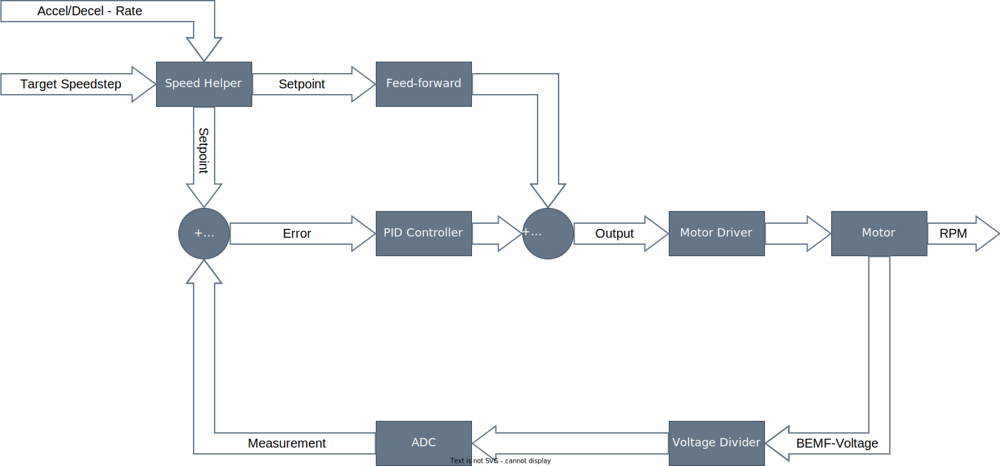

Software Description
==============================

Overview
------------------------------

Software files high level overview:

- **core0.c / core0.h**

   - DCC package detection & decoding
   - Programming mode (Modify and read CVs on programming track)
   - ADC-Offset measurement

- **core1.c / core0.h**

   - PID motor controller
   - Back-EMF voltage measurement

- **shared.c / shared.h** (used by both cores)

- Error handling
- Helper functions for retrieving CV's

- **CV.h**
  
- Default configuration variables

- **CMakeLists.txt**

   - CMake version, SDK version, C standard version
   - Board definitions
   - Compile/Build options
   - Sources files, header files
   - Debug logging configuration (via stdio using UART/USB)
   - Linked libraries

- **RP2040-Decoder-board.h or RP2040-Decoder-board-legacy.h**
   
   - Flash Size
   - Pin specification

      - LED pin when available
      - UART_TX/UART_RX when used
      - DCC input pin
      - Motor Control PWM pins
      - ADC pins

   

Conveniently, The Raspberry Pi Foundation provides a well-documented `SDK <https://datasheets.raspberrypi.com/pico/raspberry-pi-pico-c-sdk.pdf>`_ for the RP2040. The SDK provides abstraction to a higher level, and therefore there is no need to access any registers directly. Everything is written using the SDK, so hopefully, the code is easier to understand.

Motor control
------------------------------

   Motor control - Block diagram

The above block diagram in essence describes the functionality of the control loop. While the central component is the PID controller, there is an additional block called `Feed-forward <https://en.wikipedia.org/wiki/Feed_forward_(control)>`_ that has an impact on the control output variable. The Feed-forward block adds an additional offset to the output depending on the setpoint; this is done to achieve better control. A more detailed explanation regarding Feed-forward can be found below. The speed helper block corresponds to the ``speed_helper()`` function, which delays changing the setpoint according to the configured deceleration/acceleration rates.

PID Controller
~~~~~~~~~~~~~~~~~~~~~~~~~~~~~~

.. figure:: ../../../svg/sw/Block_Diagram_PID.svg
   :alt: PID Controller figure
   :align: center

   PID Controller

The block diagram above shows the PID controller in the s-domain. The derivative part contains an additional digital low-pass filter used to filter out high-frequency noise.

.. math::

   \begin{align}
   \text{Output} &= E \cdot \left(K_P + \frac{K_I}{s} + \frac{K_D \cdot s}{s \tau + 1}\right) = P + I + D \\
   P &= E \cdot K_P \\
   I &= E \cdot \frac{K_I}{s} \\
   D &= E \cdot \frac{K_D \cdot s}{s \tau + 1}
   \end{align}

With :math:`T_s` being the sampling time / controller update rate / time step of the discrete system.
And :math:`\tau` being the filter time constant of the digital filter

The continuous-time system representation can now be transformed into a discrete-time representation using `bilinear transform <https://en.wikipedia.org/wiki/Bilinear_transform>`_ :math:`s = \frac{2 \cdot (z - 1)}{T_s \cdot (z + 1)}`.

This results in the following difference equations which are then implemented in software:

.. math::
   
   \begin{align}
   p_n &= K_P \cdot e_n \\
   i_n &= 0.5 \cdot K_I \cdot \left(e_n + e_{n-1}\right) + i_{n-1} \\
   d_n &= \frac{2 K_D \cdot \left(e_n - e_{n-1}\right) + \left(2 \tau - T_s\right) \cdot d_{n-1}}{2 \tau + T_s} \\
   \text{output}_n &= p_n + i_n + d_n
   \end{align}

Also note that instead of using the derivative of error, the derivative on measurement is used. This is done to prevent a high derivative part in the event of a large change in setpoint.

Gain Scheduling
~~~~~~~~~~~~~~~~~~~~~~~~~~~~~~

.. figure:: ../../../svg/sw/adaptive_kp.svg
   :alt: Gain Scheduling figure
   :align: center
   
   Gain Scheduling

Another aspect to consider is the implementation of `gain scheduling <https://en.wikipedia.org/wiki/Gain_scheduling>`_. K\ :sub:`P` is a function of the current setpoint. Often it is favorable to have a higher proportional gain K\ :sub:`P` for slow speeds, achieving better control results. The illustration above shows the default setting for K\ :sub:`P`. CV_54 & CV_55 are used to set K\ :sub:`P` @ x\ :sub:`0`, CV_56 & CV_57 for K\ :sub:`P` @ x\ :sub:`1`, and CV_58 & CV_59 for K\ :sub:`P` @ x\ :sub:`2`. Additionally, CV_60 is used to shift x\ :sub:`1` from the leftmost point (0% = 0/255) to the rightmost point (100% = 255/255).

Feed-forward
~~~~~~~~~~~~~~~~~~~~~~~~~~~~~~

.. figure:: ../../../svg/sw/feed_forward.svg
   :alt: Feed forward figure
   :align: center
   
   Feed-forward

TODO: Update this part:

To achieve better control, `Feed-forward <https://en.wikipedia.org/wiki/Feed_forward_(control)>`_ is used. On startup, the decoder will check for a configuration regarding Feed-forward control. When no configuration is found, the decoder automatically runs a calibration to establish a base PWM level (y\ :sub:`1`) for both directions. The base PWM level (y\ :sub:`1`) will vary depending on load, motor, and voltage on the tracks and can be configured with CV_176 - CV_179. If the setpoint is greater than the threshold, y\ :sub:`2` is corrected automatically when i\ :sub:`n` reaches 0.5i\ :sub:`min` or 0.5i\ :sub:`max`. CV_47 can be used to set how sensitive this correction is.

Back-EMF voltage measurement
~~~~~~~~~~~~~~~~~~~~~~~~~~~~~~

To provide a feedback signal proportional to the motor speed, the ADC is used to measure the `Back-EMF voltage <https://en.wikipedia.org/wiki/Counter-electromotive_force>`_. The measurement works by setting the PWM duty cycle to 0%, waiting for a certain delay time (CV_62), and then measuring x times (x = CV_63). While measuring, the array with measurement values is sorted using insertion sort. Afterwards, y elements (y = CV_63) from the left (lowest values) and z elements (z = CV_64) from the right (highest values) will be dismissed to mitigate the impact of potential outliers in measurement. The average value of the remaining values will be computed and fed back into the control algorithm. Considering default settings (100us delay, 100 samples, ~2µs sampling time), the complete measurement run, including averaging, takes about 0.3ms to 0.35ms, which effectively reduces the maximum possible duty cycle to about 93% to 94%.

DCC signal decoding
------------------------------

The detection of the DCC signal works by looking at every rising and falling edge and calculating the time between them. When the time between rising and falling edge is greater than 87μs, then this is equivalent to "0"; otherwise, "1". This value then gets shifted into a 64-Bit variable.

Decoding is done after every falling edge. It starts with an error detection, which, when not passed, dismisses the received command. Then the address will be decoded and compared to the address stored in the configuration. If the address matches, the command/instruction will be decoded.

Only a few instructions are currently implemented; only 128 speed step instructions are supported.

**Implemented instructions:**

- ``0011-1111`` - (128 Speed Step Control) - 2 Byte length
- ``10XX-XXXX`` - (Function Group Instruction) (F0 - F12)
- ``110X-XXXX`` - Expansion Instruction  (F13 - F31)

All DCC instructions can be found in Section 9.2, 9.2.1, and 9.2.1.1 of the `NMRA Communications Standard <https://www.nmra.org/index-nmra-standards-and-recommended-practices>`_.
